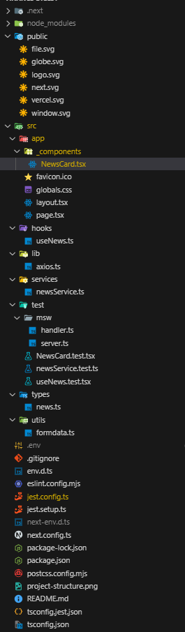

# Finance Digest 📰

A responsive, real-time finance news digest built with **Next.js**, **Axios**, and **Tailwind CSS**.  
This project consumes financial news from the [Finnhub API](https://finnhub.io/docs/api/market-news) and presents them in an elegant UI.

---

## 🔗 Live Demo

[🔍 Preview on Vercel (if hosted)](https://your-finance-digest.vercel.app)

---

## 📦 Tech Stack

- **Framework**: [Next.js](https://nextjs.org/)
- **HTTP Client**: [Axios](https://axios-http.com/)
- **Styling**: [Tailwind CSS](https://tailwindcss.com/)
- **State/Data Fetching**: [React Query](https://tanstack.com/query/latest)
- **Type Safety**: TypeScript
- **API Provider**: [Finnhub.io](https://finnhub.io)

---

## 📁 Project Structure

---

✅ Features
📡 Fetches live financial news by category (general)

🧩 Clean, component-based architecture

💡 Clickable news items open in external tab

🖼 Fully responsive UI

⚠️ Graceful error handling

🎯 Follows clean code & project structure best practices